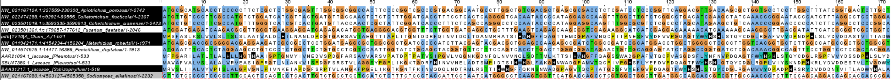
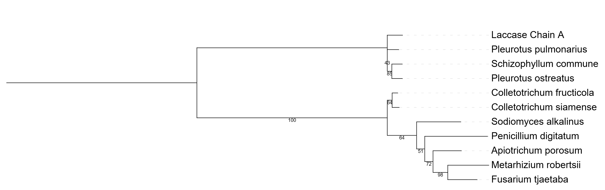

# Codigos_Analisis_filogenetico_lacasas

## Secuencias
Descargar secuencias 
```
curl "url" -O
```

Concatenar todas las secuencias .fasta
```
cat *.fasta > proyecto.fasta
```

## Clustalw
```
Module load clustalw/2.1
clustalw2
```

Opción 1 proyecto.fasta, luego opción 2 Multiple Alignments, por ultimo opción 1 multiple alignment now Slow/Accurate. El nombre del output file lac.aln.

## Árbol de maxima verosimilitud

Para copiar el FasConCAT
```
 cp -r  ~/data/FASconCAT-G_v1.05.1.pl/ .
```
Para ejecutarlo

```
./FASconCAT-G_v1.05.1.pl
```

formato Nexus por bloques y Phylip Relaxed. s para ejecutar

```
module load iqtree/1.6.12

iqtree -s FcC_supermatrix.phy -st AA -m TEST -bb 1000 -pre arbolclustal
```


Figura 1. Alineamiento en Jalview.


Figura 2. Árbol de máxima verosimilitud.
